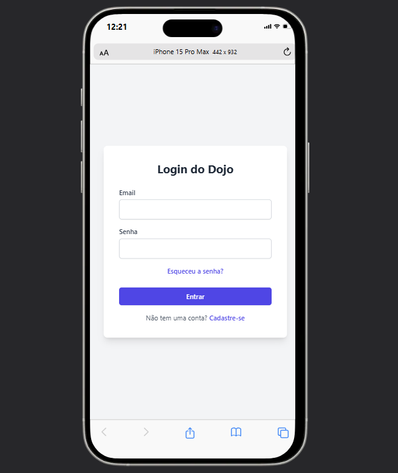
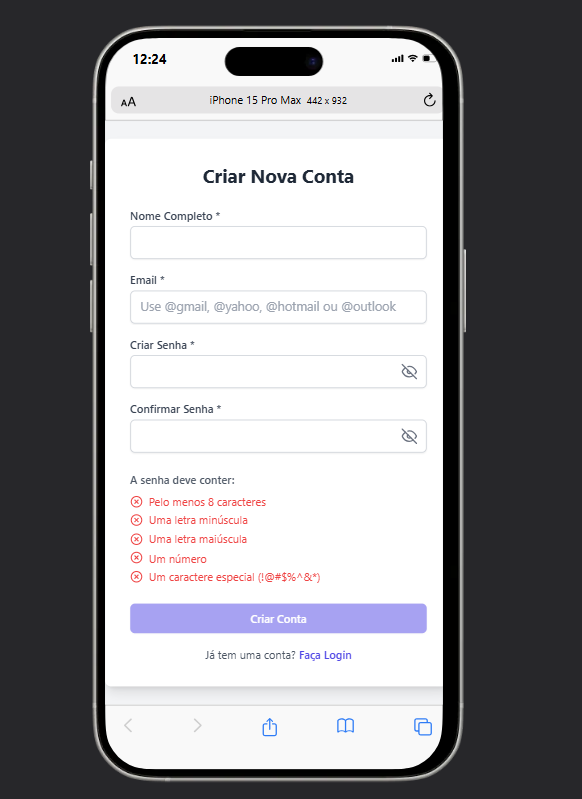
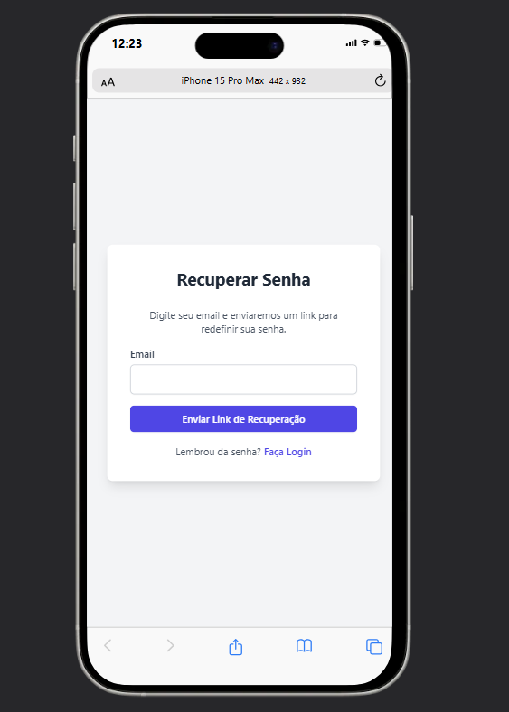
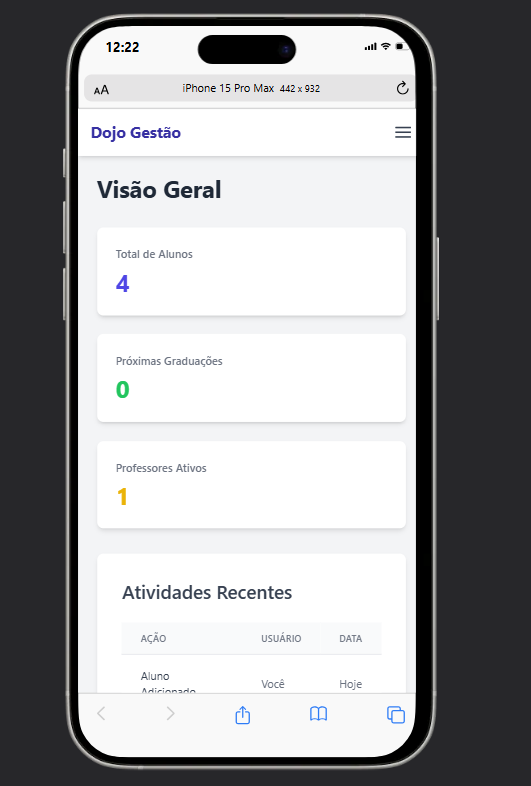
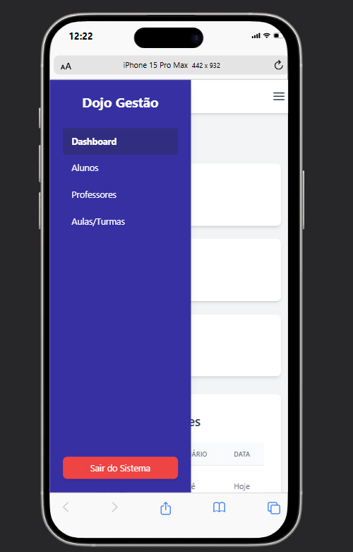
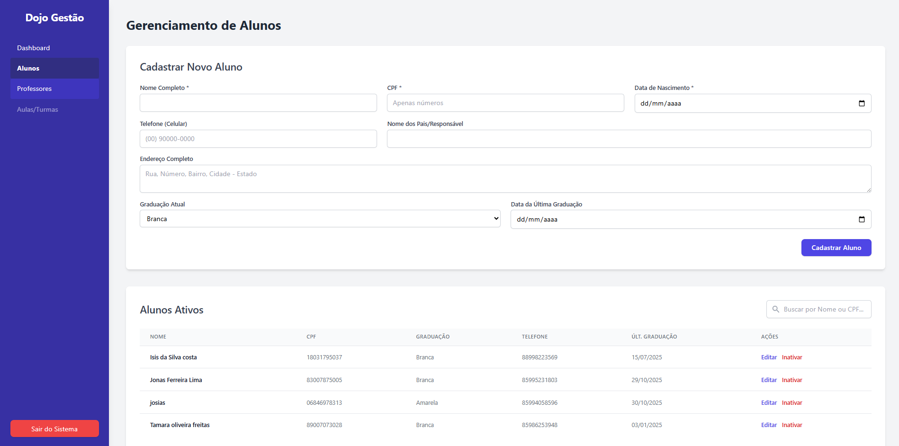

# 🥋 Sistema de Gestão de Karate Social

## 📌 Descrição
Sistema multiplataforma (Web) para apoio e gestão de um projeto social de Karate, voltado a crianças de comunidades em situação de vulnerabilidade.  
O sistema permitirá gerenciar alunos, professores, aulas e eventos, fortalecendo a organização e o impacto social do projeto.

---

# 🚨 Problema Solucionado

O projeto social atendia as crianças da comunidade, mas o gerenciamento de alunos, a comunicação com os pais e a organização de eventos eram feitos de forma manual (papel, planilhas, grupos de WhatsApp). Isto dificultava o acompanhamento, gerava falhas de comunicação e consumia muito tempo administrativo do Sensei, reduzindo o potencial de alcance do projeto.

---

# ✅ Funcionalidades Implementadas

| Funcionalidade | Status |
|----------------|--------|
| Autenticação Segura (Login/Cadastro) | Completo |
| Gestão de Segurança (Token JWT) | Completo |
| Validação de Senha Forte (Frontend) | Completo |
| Validação de Domínio de Email (Frontend) | Completo |
| Proteção de Rotas (Frontend/Backend) | Completo |
| Gestão de Alunos (CRUD) | Completo |
| Cadastro, Listagem, Edição e Inativação | Completo |
| Pesquisa por Nome ou CPF (Frontend) | Completo |
| Validação de CPF Válido (Backend) | Completo |
| Validação de Telefone (11 dígitos) (Backend) | Completo |
| Gestão de Professores (CRUD) | Completo |
| Cadastro (com criação de login), Listagem, Edição e Inativação | Completo |
| Validação de CPF Válido (Backend) | Completo |
| Gestão de Aulas/Turmas (CRUD) | Completo |
| Cadastro, Listagem (com nome do professor) | Completo |
| Design Responsivo (Mobile-First) | Completo |
| Adaptação de todas as telas (Login, Dashboard, CRUDs) para telemóvel | Completo |

---

# 📸 Screenshots

## Tela de Login




## Dashboard Responsivo



## Gestão de Alunos (CRUD)


---

## 🏗️ Arquitetura e Tecnologias Utilizadas
Este projeto utiliza uma arquitetura **MVC (Model-View-Controller)** separada entre Frontend e Backend:

- **Frontend (View):** HTML5, Tailwind CSS, JavaScript (para interatividade e chamadas de API)  
- **Backend (Controller + Model):** Python com Flask  
- **Banco de Dados (Model):** PostgreSQL  
- **ORM:** SQLAlchemy (para mapear as tabelas do PostgreSQL para classes Python)  
- **Autenticação:** JSON Web Tokens (JWT) para proteger as rotas da API  

### Servidor de Desenvolvimento (Local)
- **Backend:** Flask → `http://127.0.0.1:5000`  
- **Frontend:** Live Server → `http://127.0.0.1:5500` ou via `file:///`

---

## 🚀 Como Executar o Projeto Localmente
Para rodar este projeto na sua máquina, você precisará ter o **Python** e o **PostgreSQL** instalados.  
Siga os passos abaixo:

### 1. Clonar o Repositório
```bash
git clone https://github.com/Joaolucasos169/gestao-projeto-karate.git
cd gestao-projeto-karate
```

### 2. Configurar o Backend (Python/Flask)
Todas as etapas seguintes (3 a 6) devem ser feitas dentro da pasta backend/.
```bash
cd backend
```

### 3. Criar e Ativar o Ambiente Virtual (venv)
É crucial criar um ambiente virtual para isolar as dependências do projeto.
```bash
# 1. Criar o ambiente (use 'python3' se 'python' não funcionar)
python -m venv venv

# 2. Ativar o ambiente (Windows CMD/PowerShell)
venv\Scripts\activate
```

### 4. Criar o Ficheiro de Ambiente (.env)
Crie um ficheiro chamado .env (exatamente assim) dentro da pasta backend/ e cole o seguinte conteúdo, substituindo as senhas:
```bash
# Configurações do PostgreSQL
DB_HOST=localhost
DB_NAME=gestao_karate
DB_USER=postgres
DB_PASSWORD=sua_senha_do_postgres
DB_PORT=5432

# Chave Secreta do JWT (Use uma string longa e aleatória)
JWT_SECRET_KEY='sua_chave_secreta_muito_forte_aqui_123456'
```
⚠️ Importante: Você precisa criar manualmente a base de dados gestao_karate no seu PostgreSQL (usando pgAdmin ou psql) para que o backend consiga conectar-se.

### 5. Instalar as Dependências
Com o (venv) ativo, instale todas as bibliotecas Python necessárias:
```bash
# Garanta que o pip está atualizado
pip install --upgrade pip

# Instale tudo do requirements.txt
pip install -r requirements.txt
```

### 6. Rodar o Servidor Backend
Inicie o servidor Flask (ele rodará na porta 5000):
```bash
(venv) C:\...\backend> python -m src.app
```
O terminal deve mostrar que o servidor está rodando e que as tabelas foram criadas.
Deixe este terminal aberto.

## 7. Rodar o Frontend (Navegador)
Abra o seu projeto no VS Code.
Usando o Live Server (Recomendado)

- Clique com o botão direito no ficheiro frontend/public/index.html
Selecione "Open with Live Server"
- O navegador abrirá em:
http://127.0.0.1:5500/frontend/public/index.html

## 🔗 Links de Produção

- 🌍 Frontend (Vercel): https://gestao-projeto-karate.vercel.app
- ⚙️ Backend (Render): https://gestao-karate-backend.onrender.com