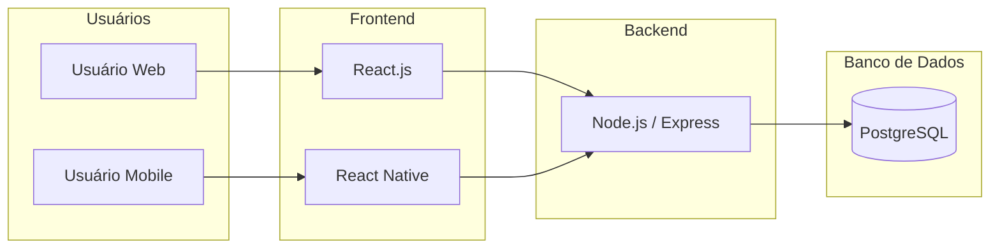

# 🏗️ Arquitetura do Sistema – Karate Social System

## 1. Visão Geral
O sistema segue o padrão arquitetural **MVC (Model-View-Controller)**, com camadas bem definidas.

## 2. Componentes
- **Frontend Web:** React.js  
- **Mobile:** React Native  
- **Backend:** Node.js com Express  
- **Banco de Dados:** PostgreSQL  
- **APIs:** RESTful APIs com autenticação JWT  

## 3. Padrões Arquiteturais
- MVC  
- RESTful APIs  
- Camadas de Service e Repository no backend para boas práticas  

## 4. Diagrama de Arquitetura
## 🔹 Diagrama da Arquitetura

## 5. Decisões Técnicas
- Escolha do stack **Full JavaScript** pela coerência entre web e mobile.  
- Uso de **PostgreSQL** por confiabilidade e aderência ao modelo relacional.  
- Deploy: **Vercel** (frontend) + **Railway** (backend e banco).  
